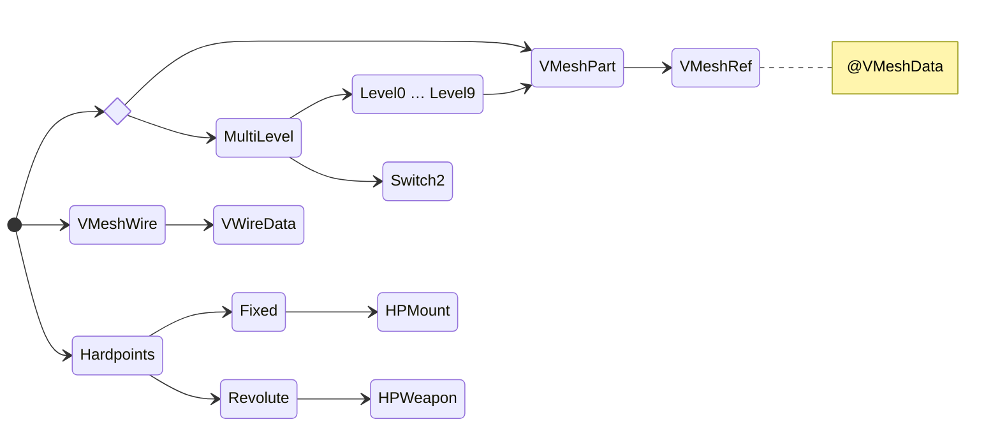

## Обзор

Файл .3db UTF.

## Уровень детализации

Для отображения модели корневая запись сетки должна содержать либо `VMeshPart`, либо `MultiLevel`, если модель имеет более одного уровня детализации (LOD).

Каждая запись уровня должна содержать `VMeshPart` (которая, в свою очередь, должна содержать `VMeshRef`), указывающую на фрагмент в `VMeshData` для рисования в качестве сетки LOD.

`MultiLevel` может содержать запись `Switch2` в виде массива чисел с плавающей запятой, начинающегося с 0, где каждое последующее число является максимальным диапазоном для уровня.

## Каркас HUD

Когда объект, использующий модель, может быть выбран в качестве цели, в списке контактов HUD может отображаться каркасная модель.

Корневая запись должна содержать запись `VMeshWire` с записью данных `VWireData` внутри.

* Обычно `VWireData` использует один из буферов сетки, уже используемых частью LOD, но может указывать на любой другой для рисования фигур, не привязанных к вершинам отображаемой сетки.