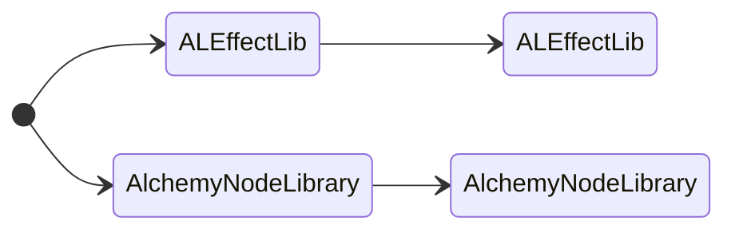

## Оглавление

- [Оглавление](#оглавление)
  - [Обзор](#обзор)
  - [Библиотека эффектов Алхимии](#библиотека-эффектов-алхимии)
    - [Эффект](#эффект)
  - [Библиотека узлов Алхимии](#библиотека-узлов-алхимии)
    - [Boolean (0x1 или 0x8001)](#boolean-0x1-или-0x8001)
    - [Integer (0x2)](#integer-0x2)
    - [Float (0x3)](#float-0x3)
    - [String (0x103)](#string-0x103)
    - [Color blending (0x104) - Смешивание цветов](#color-blending-0x104---смешивание-цветов)
    - [Transform (Преобразование) (0x105)](#transform-преобразование-0x105)
    - [Animated float (Анимационный плавающий элемент) (0x200)](#animated-float-анимационный-плавающий-элемент-0x200)
    - [Animated color (Анимированный цвет) (0x201)](#animated-color-анимированный-цвет-0x201)
    - [Animated curve (Анимированная кривая) (0x202)](#animated-curve-анимированная-кривая-0x202)
    - [Типы замедления](#типы-замедления)
    - [Флаги (битовые значения)](#флаги-битовые-значения)
    - [Оценка значения анимированной кривой](#оценка-значения-анимированной-кривой)

### Обзор

Алхимия — это система эффектов частиц в рендеринге Freelancer. Практически все визуальные эффекты создаются в этой системе, например, снаряды оружия, взрывы, выхлопы двигателей и многое другое.



Данные алхимии представлены двумя записями в UTF:

- `ALEffectLib` для библиотеки эффектов.
- `AlchemyNodeLibrary` для библиотеки узлов.

Обе записи появляются в файлах .ale внутри папок с одинаковыми именами.

Строки в структурах ALE (astring) заканчиваются символом NUL и имеют префикс с количеством символов в виде uint16. Количество символов всегда четное, независимо от фактической длины строки: в конце строки всегда будет один или два байта NUL.

- [Узлы алхимии](./ale-nodes.md)

### Библиотека эффектов Алхимии

Библиотека эффектов содержит записи эффектов, на которые ссылаются файлы .ini эффектов через свойство `effect_crc` раздела [VisEffect].

| Имя         | Тип       | Описание              |
| ----------- | --------- | --------------------- |
| version     | float     | Версия (1.0 или 1.1). |
| effectCount | uint32    | Колиечество эффектов. |
| _effects_   | _varying_ |                       |

#### Эффект

Один эффект состоит из иерархии экземпляров узлов, которые ссылаются на архетипы узлов в библиотеке узлов Алхимии. Эти узлы обычно делятся на три категории: излучатели, внешний вид и поля.

Излучатели генерируют частицы (точки в пространстве с направлением и скоростью), внешний вид визуализирует частицы, которые будут отображаться с определенными формами, цветами и текстурами, а поля могут физически воздействовать на частицы, например, прикладывая силу тяжести для ускорения частиц.

| Имя             | Тип       | Описание                                          |
| --------------- | --------- | ------------------------------------------------- |
| name            | astring   | Название эффекта (например: «gf_jumpgate_rings»). |
| unused          | float[4]  | Неиспользуемые плавающие точки.                   |
| instanceCount   | uint32    | Количество экземпляров узлов.                     |
| _nodeInstances_ | _varying_ | Экземпляры узлов.                                 |
| pairCount       | uint32    | Количество пар узлов.                             |
| _nodePairs_     | _varying_ | Пары узлов.                                       |

- Неиспользуемые плавающие точки появляются только в версии 1.1f.

Каждый экземпляр узла представляет собой:

| Имя      | Тип    | Описание                                                             |
| -------- | ------ | -------------------------------------------------------------------- |
| flags    | uint32 | 1 для узла присоединения, 0 для узла экземпляра.                     |
| name     | uint32 | Значение Node_Name узла FLCRC32 (чувствительно к регистру).          |
| parentId | int32  | Идентификатор родительского объекта узла (32768 для отсутствующего). |
| refId    | int32  | Идентификатор экземпляра узла.                                       |

- CRC, указывающий на узел в библиотеке узлов CRC параметра «Node_Name».
- Индексы экземпляров узлов начинаются с 1.
- Порядок экземпляров узлов используется для порядка рисования.

Каждая пара узлов представляет собой:

| Имя      | Тип   | Описание                                                  |
| -------- | ----- | --------------------------------------------------------- |
| sourceId | int32 | Пара экземпляров исходного узла (излучатель/внешний вид). |
| targetId | int32 | Пара экземпляров целевого узла (внешний вид/поле).        |

### Библиотека узлов Алхимии

Библиотека узлов представляет собой набор архетипов узлов. Узлы имеют свойство типа, описывающее их поведение, и список свойств, некоторые из которых являются фиксированными значениями, а некоторые — анимированными.

| Имя       | Тип       | Описание              |
| --------- | --------- | --------------------- |
| version   | float32   | Версия (1.0 или 1.1). |
| nodeCount | uint32    | Количество узлов.     |
| _nodes_   | _varying_ | Архетип узла.         |

Архетип отдельного узла содержит:

| Имя          | Тип       | Описание                                  |
| ------------ | --------- | ----------------------------------------- |
| name         | astring   | Тип узла (например: «FxBasicAppearance»). |
| _properties_ | _varying_ | Свойства узла.                            |

- Считывать свойства узла, пока тип свойства не станет равным 0.

Каждое свойство:

| Имя    | Тип       | Описание                                    |
| ------ | --------- | ------------------------------------------- |
| type   | uint16    | Тип значения свойства.                      |
| name   | uint32    | FLCRC32 имени свойства (с учетом регистра). |
| _data_ | _varying_ | Данные о недвижимости по типу.              |

Тип:

| Значение | Имя       | Анимированные |
| -------- | --------- | ------------- |
| 0x001    | Boolean   | Нет           |
| 0x002    | Integer   | Нет           |
| 0x003    | Float     | Нет           |
| 0x103    | String    | Нет           |
| 0x104    | Blending  | Нет           |
| 0x105    | Transform | Да            |
| 0x200    | Float     | Да            |
| 0x201    | Color     | Да            |
| 0x202    | Curve     | Да            |

#### Boolean (0x1 или 0x8001)

- Не содержит данных, истинность/ложность определяется по старшему биту, т.е. 0x1 — ложь, а 0x8001 — истина.

#### Integer (0x2)

| Имя   | Тип   | Описание               |
| ----- | ----- | ---------------------- |
| value | int32 | Целое число со знаком. |

#### Float (0x3)

| Имя   | Тип   | Описание                           |
| ----- | ----- | ---------------------------------- |
| value | float | Значение числа с плавающей точкой. |

#### String (0x103)

| Имя   | Тип     | Описание            |
| ----- | ------- | ------------------- |
| value | astring | Строковое значение. |

#### Color blending (0x104) - Смешивание цветов

| Имя    | Тип    | Описание                                        |
| ------ | ------ | ----------------------------------------------- |
| source | uint32 | Режим смешивания источников.                    |
| target | uint32 | Режим смешивания целевых объектов (назначение). |

Возможные значения источника и цели:

| Value | Имя                   | Factor                                                                     |
| ----- | --------------------- | -------------------------------------------------------------------------- |
| 1     | D3DBLEND_ZERO         | 0, 0, 0, 0                                                                 |
| 2     | D3DBLEND_ONE          | 1, 1, 1, 1                                                                 |
| 3     | D3DBLEND_SRCCOLOR     | R<sub>s</sub>, G<sub>s</sub>, B<sub>s</sub>, A<sub>s</sub>                 |
| 4     | D3DBLEND_INVSRCCOLOR  | 1 - R<sub>s</sub>, 1 - G<sub>s</sub>, 1 - B<sub>s</sub>, 1 - A<sub>s</sub> |
| 5     | D3DBLEND_SRCALPHA     | A<sub>s</sub>, A<sub>s</sub>, A<sub>s</sub>, A<sub>s</sub>                 |
| 6     | D3DBLEND_INVSRCALPHA  | 1 - A<sub>s</sub>, 1 - A<sub>s</sub>, 1 - A<sub>s</sub>, 1 - A<sub>s</sub> |
| 7     | D3DBLEND_DESTALPHA    | A<sub>d</sub>, A<sub>d</sub>, A<sub>d</sub>, A<sub>d</sub>                 |
| 8     | D3DBLEND_INVDESTALPHA | 1 - A<sub>d</sub>, 1 - A<sub>d</sub>, 1 - A<sub>d</sub>, 1 - A<sub>d</sub> |
| 9     | D3DBLEND_DESTCOLOR    | R<sub>d</sub>, G<sub>d</sub>, B<sub>d</sub>, A<sub>d</sub>                 |
| 10    | D3DBLEND_INVDESTCOLOR | 1 - R<sub>d</sub>, 1 - G<sub>d</sub>, 1 - B<sub>d</sub>, 1 - A<sub>d</sub> |
| 11    | D3DBLEND_SRCALPHASAT  | f, f, f, 1 (f = min(A<sub>s</sub>, 1 - A<sub>d</sub>))                     |

#### Transform (Преобразование) (0x105)

| Имя       | Тип      | Описание                 |
| --------- | -------- | ------------------------ |
| flags     | uint32   |                          |
| translate | curve[3] | Преобразование анимации. |
| rotate    | curve[3] | Вращение анимации.       |
| scale     | curve[3] | Масштаб анимации.        |

- Тип кривой — анимированная структура кривой.
- Если старший байт в флагах равен 0, пропустить перевод/поворот/масштабирование.

#### Animated float (Анимационный плавающий элемент) (0x200)

| Имя           | Тип       | Описание                                             |
| ------------- | --------- | ---------------------------------------------------- |
| easing        | uint8     | Тип смягчения значения смешивания.                   |
| keyframeCount | uint8     | Количество ключевых кадров смешивания (1 или более). |
| _keyframes_   | _varying_ | Смешивание ключевых кадров.                          |

Каждый ключевой кадр параметра смешивания:

| Имя           | Тип       | Описание                                  |
| ------------- | --------- | ----------------------------------------- |
| key           | float     | Ключ параметра.                           |
| easing        | uint8     | Тип смягчения значения.                   |
| keyframeCount | uint8     | Количество ключевых кадров (1 или более). |
| _keyframes_   | _varying_ | Ключевые кадры значения.                  |

Каждый ключевой кадр значения:

| Имя   | Тип   | Описание                         |
| ----- | ----- | -------------------------------- |
| key   | float | Ключевой кадр.                   |
| value | float | Значение номера ключевого кадра. |

- Обычно анимированный ключ float является относительным (от 0,0 до 1,0).

#### Animated color (Анимированный цвет) (0x201)

| Имя           | Тип       | Описание                                             |
| ------------- | --------- | ---------------------------------------------------- |
| easing        | uint8     | Тип смягчения значения смешивания.                   |
| keyframeCount | uint8     | Смешивание количества ключевых кадров (1 или более). |
| _keyframes_   | _varying_ | Смешивание ключевых кадров.                          |

Каждый ключевой кадр параметра смешивания:

| Имя           | Тип       | Описание                                  |
| ------------- | --------- | ----------------------------------------- |
| key           | float     | Ключ параметра.                           |
| easing        | uint8     | Тип смягчения значения.                   |
| keyframeCount | uint8     | Количество ключевых кадров (1 или более). |
| _keyframes_   | _varying_ | Ключевые кадры значения.                  |

Каждый ключевой кадр значения:

| Имя   | Тип      | Описание                              |
| ----- | -------- | ------------------------------------- |
| key   | float    | Ключевой кадр.                        |
| value | float[3] | Значение цвета ключевого кадра (RGB). |

- Обычно анимированный цветовой ключ является относительным (от 0,0 до 1,0).

#### Animated curve (Анимированная кривая) (0x202)

| Имя           | Тип       | Описание                                             |
| ------------- | --------- | ---------------------------------------------------- |
| easing        | uint8     | Тип смягчения значения смешивания.                   |
| keyframeCount | uint8     | Смешивание количества ключевых кадров (1 или более). |
| _keyframes_   | _varying_ |                                                      |

Каждый ключевой кадр параметра смешивания:

| Имя           | Тип       | Описание                                                    |
| ------------- | --------- | ----------------------------------------------------------- |
| key           | float     | Ключ параметра.                                             |
| defaultValue  | float     | Значение по умолчанию.                                      |
| wrapFlags     | uint16    | Обозначение флагами ключей, выходящих за пределы диапазона. |
| keyframeCount | uint16    | Количество ключевых кадров (0 или более).                   |
| _keyframes_   | _varying_ | Ключевые кадры значения.                                    |

Каждый ключевой кадр значения:

| Имя      | Тип   | Описание                            |
| -------- | ----- | ----------------------------------- |
| key      | float | Ключевой кадр.                      |
| value    | float | Значение ключевого кадра.           |
| valueOut | float | Исходящее значение ключевого кадра. |
| valueIn  | float | Входящее значение ключевого кадра.  |

- Обычно ключом анимированной кривой является время (секунды).

#### Типы замедления

| Значение | Описание                         |
| -------- | -------------------------------- |
| 1        | Линейный.                        |
| 2        | Плавное начало (ускорение).      |
| 3        | Плавное завершение (замедление). |
| 4        | Плавное начало и завершение.     |
| 5        | Пошагово .                       |

#### Флаги (битовые значения)

Определите, что произойдет, если значения выйдут за пределы допустимого диапазона.

| Значение | Описание                                  |
| -------- | ----------------------------------------- |
| 0x0001   | Повтор до начала диапазона.               |
| 0x0002   | Отражение до начала диапазона.            |
| 0x0004   | Фиксация (зажатие) до начала диапазона.   |
| 0x0010   | Повтор после конца диапазона.             |
| 0x0020   | Отражение после конца диапазона.          |
| 0x0040   | Фиксация (зажатие) после конца диапазона. |

---

#### Оценка значения анимированной кривой

```ts
/**
 * Оценить значение кривой между ключевыми кадрами.
 * @param w Переходное состояние между ключевыми кадрами
 * @param a Начальное значение ключевого кадра
 * @param b Конечное значение ключевого кадра
 * @param d Дельта между начальным и конечным ключами ключевого кадра
 * @returns
 */
mixCurve(w: number, a: Vector3, b: Vector3, d: number) {
    const { x: ax, z: av } = a;
    const { x: bx, y: bv } = b;

    d *= .5;

    const a0 = ax + av * d;
    const b0 = bx - bv * d;

    const a1 = lerp(w, ax, a0);
    const b1 = lerp(w, a0, bx);

    const a2 = lerp(w, ax, b0);
    const b2 = lerp(w, b0, bx);

    const a3 = lerp(w, a1, a2);
    const b3 = lerp(w, b1, b2);

    return lerp(w, a3, b3);
}
```

- `lerp`— это общая линейная интерполяционная функция.
