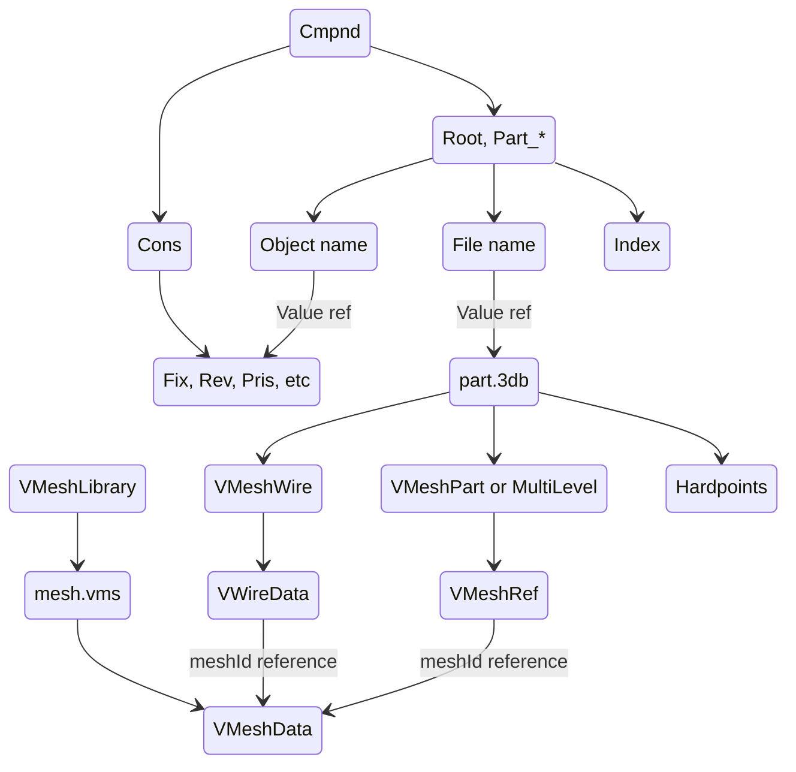

## Обзор

Комплекс, состоящий из нескольких частей. Корабли с разрушаемыми частями, станции с док-портами, имеющими подвижные двери, и т. д.

Комплексная модель включает в себя одну или несколько .3db, используя общие ресурсы (сетки, материалы и т. д.) между частями.

Запись `Cmpnd` содержит часть `Root` и другие части, начинающиеся с префикса `Part_`. Иерархические отношения между частями определяются в записи ограничений `Cons`.

## Ограничения

* Имена родительских и дочерних частей в ограничениях всегда имеют размер 64 байта, независимо от фактической длины строки, строка обрезается на символе NUL.

### Fix (fixed)

| Имя        | Тип     | Описание          |
| ----------- | -------- | -------------------- |
| parent      | char[64] | Имя родителя.         |
| child       | char[64] | Имя ребенка.          |
| translation | float[3] | Вектор сдвига.  |
| rotation    | float[9] | Матрица поворота 3x3. |

* Неодушевленный, но может быть сделан разрушаемым через раздел [CollisionGroup] в архетипе.

### Rev (revolute)

| Имя        | Тип     | Описание            |
| ----------- | -------- | ---------------------- |
| parent      | char[64] | Имя родителя.           |
| child       | char[64] | Имя ребенка.            |
| translation | float[3] | Вектор сдвига.    |
| offset      | float[3] | Вектор смещения.         |
| rotation    | float[9] | Матрица поворота 3x3.   |
| axis        | float[3] | Вектор оси направления. |
| min         | float    | Минимальный угол.             |
| max         | float    | Максимальный угол.             |

* Анимация с помощью ключевых кадров с одним значением типа float.

### Pris (prismatic)

| Имя        | Тип     | Описание            |
| ----------- | -------- | ---------------------- |
| parent      | char[64] | Имя родителя.           |
| child       | char[64] | Имя ребенка.            |
| translation | float[3] | Вектор сдвига.    |
| offset      | float[3] | Вектор смещения. Unused. |
| rotation    | float[9] | Матрица поворота 3x3.   |
| axis        | float[3] | Вектор оси направления. |
| min         | float    | Минимальная длина.            |
| max         | float    | Максимальная длина.            |

* Анимация с помощью ключевых кадров с одним значением типа float.

### Cyl (cylindric)

| Имя        | Тип     | Описание          |
| ----------- | -------- | -------------------- |
| parent      | char[64] | Имя родителя.         |
| child       | char[64] | Имя ребенка.          |
| translation | float[3] | Вектор сдвига.  |
| offset      | float[3] | Вектор смещения.       |
| rotation    | float[9] | Матрица поворота 3x3. |
| axis        | float[3] | Ось направления.      |
| rotateMin   | float    |                      |
| rotateMax   | float    |                      |
| slideMin    | float    |                      |
| slideMax    | float    |                      |

* ❗ Существует, но, по-видимому, не используется. Попытка анимировать цилиндрическое соединение приводит к сбою игры.

### Sphere (spherical)

Шарнирное соединение и, в отличие от ограничения поворота, его вращение не фиксировано по оси.

| Имя        | Тип     | Описание          |
| ----------- | -------- | -------------------- |
| parent      | char[64] | Имя родителя.         |
| child       | char[64] | Имя ребенка.          |
| translation | float[3] | Вектор сдвига.  |
| rotation    | float[9] | Матрица поворота 3x3. |
| pitchMin    | float    |                      |
| pitchMax    | float    |                      |
| yawMin      | float    |                      |
| yawMax      | float    |                      |
| rollMin     | float    |                      |
| rollMax     | float    |                      |

* Анимация с помощью ключевых кадров со значением кватерниона.

### Loose

Обеспечивает свободное движение (перемещение и вращение).

| Имя        | Тип     | Описание          |
| ----------- | -------- | -------------------- |
| parent      | char[64] | Имя родителя.         |
| child       | char[64] | Имя ребенка.          |
| translation | float[3] | Вектор сдвига.  |
| rotation    | float[9] | Матрица поворота 3x3. |

* Анимация с помощью ключевых кадров со значениями векторов и кватернионов.