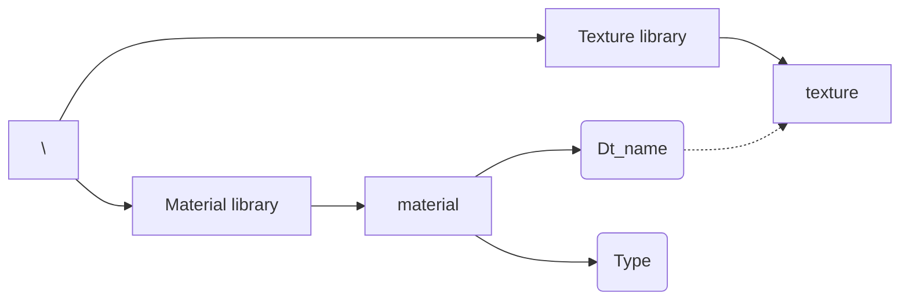
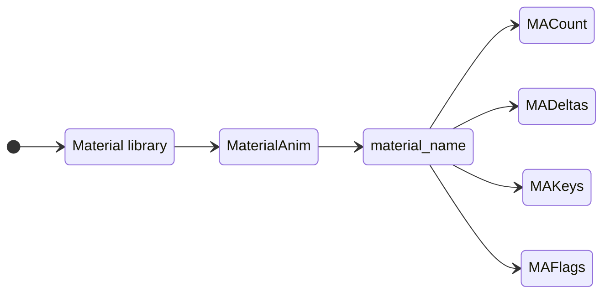

## Обзор

Материалы хранятся либо в отдельном файле (.mat), либо встроены в файлы модели (.3db, .cmp, .dfm и т. д.).

Некоторые ресурсы не могут иметь ссылки на внешние файлы с материалами и требуют встраивания материалов непосредственно в файл модели, например, звездные сферы, реквизит для кат-сцен и деформируемые модели.

### Типы материалов

| Тип                           | Альфа | Описание                                                                                                                        |
| ----------------------------- | ----- | ------------------------------------------------------------------------------------------------------------------------------- |
| DcDt                          | No    | Диффузный цвет + диффузная текстура.                                                                                            |
| DcDtTwo                       | No    | Двусторонний вариант DcDt.                                                                                                      |
| DcDtEc                        | No    | Диффузный цвет + Диффузная текстура + Цвет излучения.                                                                           |
| DcDtEcTwo                     | No    | Двусторонний вариант DcDtEc.                                                                                                    |
| DcDtOcOt                      | Yes   | Рассеянный цвет + Рассеянная текстура + Цвет непрозрачности + Текстура непрозрачности.                                          |
| DcDtOcOtTwo                   | Yes   | Двусторонний вариант DcDtOcOt.                                                                                                  |
| DcDtEcOcOt                    | Yes   | Диффузный цвет + Диффузная текстура + Цвет излучения + Цвет непрозрачности + Текстура непрозрачности.                           |
| DcDtEcOcOtTwo                 | Yes   | Двусторонний вариант DcDtEcOcOt.                                                                                                |
| DcDtEt                        | No    | Диффузный цвет + Диффузная текстура + Текстура излучения.                                                                       |
| EcEt                          | No    | Цвет излучения + текстура излучения.                                                                                            |
| Nebula                        | Yes   | Диффузная текстура, окрашенная цветом вершины с смешением (ADD, SRCALPHA, ONE).                                                 |
| NebulaTwo                     | Yes   | Двусторонняя версия Nebula.                                                                                                     |
| BtDetailMapMaterial           | No    | Диффузная текстура с детальной текстурой, наложенной в режиме наложения. Детальная текстура использует второй набор UV-текстур. |
| BtDetailMapMaterialTwo        | No    | Двусторонний вариант DetailMaterial.                                                                                            |
| NomadMaterial                 | Yes   | Специальный материал для кораблей кочевников.                                                                                   |
| NomadMaterialNoBendy          | Yes   | Ditto.                                                                                                                          |
| GlassMaterial                 | Yes   | Прозрачный материал, используемый для кабины.                                                                                   |
| GFGlassMaterial               | Yes   | Ditto.                                                                                                                          |
| HighGlassMaterial             | Yes   | Ditto.                                                                                                                          |
| PlanetWaterMaterial           | Yes   | Материал с режимом наложения «Умножение».                                                                                       |
| AtmosphereMaterial            | Yes   |                                                                                                                                 |
| ExclusionZoneMaterial         | Yes   | Материал для оболочек зоны исключения.                                                                                          |
| HUDIconMaterial               | Yes   | Материал для значков HUD.                                                                                                       |
| HUDAnimMaterial               | Yes   | Анимационный материал для HUD. Анимация включается в настройках.                                                                |
| NullMaterial                  | No    | Резервный материал.                                                                                                             |
| DetailMapMaterial             | No    |                                                                                                                                 |
| DetailMap2Dm1Msk2PassMaterial | No    |                                                                                                                                 |
| IllumDetailMapMaterial        | No    |                                                                                                                                 |
| Masked2DetailMapMaterial      | No    |                                                                                                                                 |

- `NomadMaterial` и `NomadMaterialNoBendy` не отображаются, когда для объекта используется карта окружения.
- ❗ Тип материала можно переопределить, сопоставив регулярное выражение в [MaterialMap] файла dacom.ini.

Когда модель использует как прозрачные, так и непрозрачные (непрозрачные) материалы, она должна быть составлена из нескольких частей, и любые группы сеток, использующие прозрачные материалы, должны храниться в частях, отдельных от групп сеток, использующих непрозрачные материалы, т. е. прозрачное стекло кабины должно быть отделено от корпуса, к которому оно прикреплено. Группы сеток с непрозрачными материалами рисуются спереди назад, после чего группы сеток с прозрачными материалами рисуются сзади вперед с отключенной записью буфера глубины.

#### Свойства материалов

| Имя       | Тип      | Описание                                      |
| --------- | -------- | --------------------------------------------- |
| Ac        | float[3] | Цвет окружающей среды.                        |
| Dc        | float[3] | Рассеянный цвет.                              |
| Oc        | float    | Цвет непрозрачности (альфа).                  |
| Ec        | float[3] | Цвет излучения.                               |
| Sc        | float[3] | Зеркальный цвет.                              |
| Sp        | float    | Зеркальная сила.                              |
| Dt_name   | string   | Название диффузной текстуры.                  |
| Dt_flags  | uint32   | Флаги обертывания диффузной текстуры.         |
| Et_name   | string   | Имя текстуры излучения.                       |
| Et_flags  | uint32   | Флаги обёртки текстуры излучения.             |
| Bt_name   | string   | Имя текстуры деталей.                         |
| Bt_flags  | uint32   | Флаги обёртки текстуры деталей.               |
| Nt_name   | string   | Имя текстуры Nomad.                           |
| Nt_flags  | uint32   | Флаги обёртки текстуры Nomad.                 |
| Alpha     | float    | Уровень прозрачности.                         |
| Fade      | float    | Коэффициент затухания при крутом угле обзора. |
| Scale     | float    | Масштаб смещения вершин?                      |
| Dm_name   | string   | Имя текстуры диффузной маски.                 |
| Dm_flags  | uint32   | Флаги обёртки текстуры диффузной маски.       |
| TileRate  | float    | Множитель тайлинга диффузной маски.           |
| Dm0_name  | string   | Имя текстуры диффузной маски 0.               |
| Dm0_flags | uint32   | Флаги обёртки текстуры диффузной маски 0.     |
| TileRate0 | float    | Множитель тайлинга диффузной маски 0.         |
| Dm1_name  | string   | Имя текстуры диффузной маски 1.               |
| Dm1_flags | uint32   | Флаги обёртки текстуры диффузной маски 1.     |
| TileRate1 | float    | Множитель тайлинга диффузной маски 1.         |
| flip u    | uint32   | Отразить текстуру по горизонтали.             |
| flip v    | uint32   | Отразить текстуру по вертикали.               |

- `Ac` используется в `AtmosphereMaterial`, но может применяться ко многим другим материалам для переопределения фонового цвета сцены.
- `Oc` используется в любом прозрачном материале.
- `Ec` используется в `DcDtEc`, `DcDtEcOcOt`, `EcEt`.
- ❗ Параметры `«Ot_name»` и `«Ot_flags»` отсутствуют, поскольку прозрачность берётся из альфа-канала форматов текстур, которые поддерживают прозрачность.
- `Et_name` и `Et_flags` используются в `DcDtEt` и `EcEt`.
- `Bt_name` и `Bt_flags` используются в `BtDetailMapMaterial` и `BtDetailMapMaterialTwo`.
- `Nt_name` и `Nt_flags` используются в `NomadMaterial` и `NomadMaterialNoBendy`.
- `Alpha`, `Fade` и `Scale` используются в `AtmosphereMaterial`.
- `Dm_name`, `Dm_flags` и `TileRate` используются в `DetailMapMaterial`.
- `Dm0_name`, `Dm0_flags` и `TileRate0` используются в `DetailMap2Dm1Msk2PassMaterial`, `IllumDetailMapMaterial` и `Masked2DetailMapMaterial`.
- `Dm1_name`, `Dm1_flags` и `TileRate1` используются в `DetailMap2Dm1Msk2PassMaterial`, `IllumDetailMapMaterial` и `Masked2DetailMapMaterial`.

## Материальная анимация

Анимация материала хранится в файле модели и допускает простое смещение UV и масштабирование циклической анимации по ключевым кадрам.

| Имя      | Тип       | Описание                                               |
| -------- | --------- | ------------------------------------------------------ |
| MACount  | uint32    | Количество ключевых кадров MADeltas.                   |
| MADeltas | _varying_ | Ключевые кадры смещения UV и масштабирования скорости. |
| MAKeys   | _varying_ | Ключевые кадры смещения и масштабирования UV.          |
| MAFlags  | uint32    | Флаги анимации.                                        |

Каждый ключевой кадр в `MADeltas`:

| Имя          | Тип   | Описание                            |
| ------------ | ----- | ----------------------------------- |
| time         | float | Время ключевого кадра.              |
| uOffsetSpeed | float | Скорость смещения тайлинга U.       |
| vOffsetSpeed | float | Скорость смещения тайлинга V.       |
| uScaleSpeed  | float | Скорость масштабирования мозаики U. |
| vScaleSpeed  | float | Скорость масштабирования мозаики V. |

Каждый ключевой кадр в `MAKeys`:

| Имя     | Тип   | Описание              |
| ------- | ----- | --------------------- |
| uOffset | float | Начальное смещение U. |
| vOffset | float | Начальное смещение V. |
| uScale  | float | Начальная шкала U.    |
| vScale  | float | Начальная шкала V.    |

- Количество ключевых кадров `MAKeys` будет на один меньше `MACount`. Первый ключевой кадр — это неявное состояние исходных значений UV.
