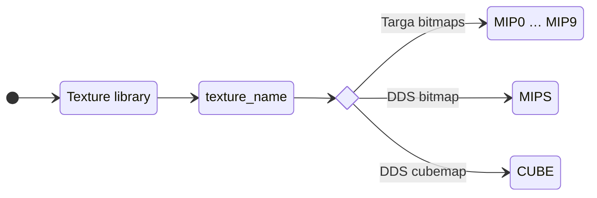
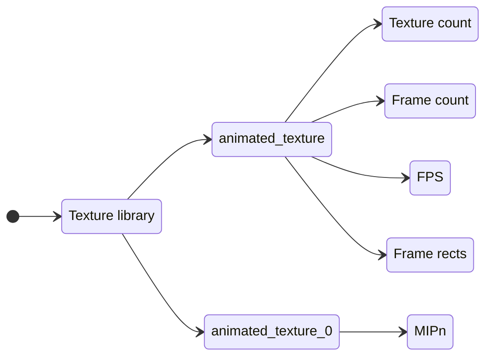

## Обзор

Текстуры либо хранятся в отдельном файле (.txm), либо встроены в файлы моделей (.3db, .cmp, .dfm и т. д.).

Freelancer поддерживает следующие типы:

- Несжатые изображения Targa (.tga) в 16-битном (5551, RGB), 24-битном (888, RGB) и 32-битном (8888, RGBA) режимах. ❗ Изображения Targa и/или палитры, сжатые RLE, не поддерживаются.
- Изображения DirectDrawSurface (.dds) в несжатом или сжатом DXT режимах. Для отображения окружения поддерживаются кубические карты.

Изображения Targa хранятся по отдельности в виде записей MIPn, начиная с 0, что соответствует полному размеру, а каждая последующая запись — половине размера предыдущей MIP-карты.
Изображение DirectDrawSurface будет включать MIP-карты (если они есть) и попадёт в запись MIPS.

# Текстурная анимация

Freelancer поддерживает покадровую (переворачивающуюся) анимацию текстур.

| Имя           | Тип       | Описание                                         |
| ------------- | --------- | ------------------------------------------------ |
| Texture count | int32     | Текстуры, используемые в анимации. (1 или более) |
| Frame count   | int32     | Общее количество кадров.                         |
| FPS           | float     | Частота кадров анимации.                         |
| Frame rects   | _varying_ | Анимационные кадры.                              |

- Отдельные текстуры затем должны использовать суффикс \_n, где n — индекс текстуры, начинающийся с 0. Например, текстура с именем `lightning256` будет содержать записи, указанные выше, а другая текстура `lightning256_0` будет содержать фактические записи MIPn/MIPS, хранящие растровые изображения.

Каждый кадр анимации:

| Имя    | Тип   | Описание                                   |
| ------ | ----- | ------------------------------------------ |
| index  | int32 | Индекс изображения текстуры (начиная с 0). |
| startU | float | Координата U начальной точки.              |
| startV | float | Координата V начальной точки.              |
| endU   | float | Координата U конечной точки.               |
| endV   | float | Координата V конечной точки.               |

- Начало координат в левом верхнем углу.
