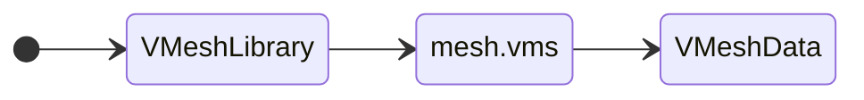
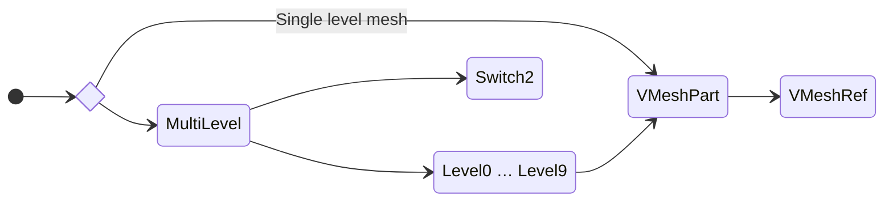
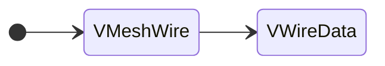

## Обзор

Сетки обычно встраиваются в файлы жестких моделей (.3db и .cmp), за исключением пользовательского интерфейса, где данные сетки хранятся в отдельном файле .vms.

## VMeshData

VMeshData — это, по сути, большой буфер вершин/индексов, который содержит все вершины и треугольники одной или нескольких частей. Однако, когда VMeshData содержит сетки из нескольких частей, он не знает, сколько их всего, это просто хранилище, но косвенным указанием на то, что в его наборе данных начинается другая часть, является значение VMeshGroup.vertexStart, равное 0, и индекс вершины в треугольнике, также начинающийся с 0. Обычно части никогда не имеют общих вершин, но группы сеток внутри одной части могут иметь.

| Имя           | Тип       | Описание                                    |
| ------------- | --------- | ------------------------------------------- |
| meshType      | uint32    | Всегда 1. В противном случае игра вылетает. |
| primitiveType | uint32    | Тип примитива Direct3D.                     |
| groupCount    | uint16    | Количество групп сетки.                     |
| indexCount    | uint16    | Количество элементов в буфере.              |
| vertexFormat  | uint16    | Direct3D FVF (гибкий формат вершин).        |
| vertexCount   | uint16    | Количество буферов вершин.                  |
| _groups_      | _varying_ | Сетчатые группы.                            |
| _indices_     | _varying_ | Индексы элементов.                          |
| _vertices_    | _varying_ | Данные атрибутов вершин.                    |

- Индексы элементов имеют тип uint16.
- Длина атрибута вершины зависит от режима FVF.
- VMeshData может быть сопоставлен с OpenGL VAO (Vertex Array Object).

Примитивные типы:

| Ценность | Тип                  |
| -------- | -------------------- |
| 1        | Список точек         |
| 2        | Список линий         |
| 3        | Линейная полоса      |
| 4        | Список треугольников |
| 5        | Треугольная полоса   |
| 6        | Веер треугольников   |

Это флаги и режимы формата вершин, которые использует Freelancer:

| Имя            | Mask value | Описание | Vertex value |
| -------------- | ---------- | -------- | ------------ |
| D3DFVF_XYZ     | 0x0001     | Position | float[3]     |
| D3DFVF_NORMAL  | 0x0010     | Normal   | float[3]     |
| D3DFVF_DIFFUSE | 0x0040     | Color    | uint32       |
| D3DFVF_TEXn    | 0xFF00     | UV1-8    | float[2]     |

- Поддерживаются D3DFVF_XYZ, D3DFVF_NORMAL, D3DFVF_DIFFUSE и D3DFVF_TEX0–D3DFVF_TEX8.
- D3DFVF_PSIZE и D3DFVF_SPECULAR не поддерживаются и приведут к повреждению отрисовки.

Группа сеток — это набор вершин и индексов вершин, образующих треугольники, которые сгруппированы по одному идентификатору материала. В Freelancer довольно часто модель или даже отдельная часть сложной модели использует несколько материалов. Таким образом, модель или каждая из ее частей может использовать одну или несколько групп, если в них используется несколько материалов.

| Имя         | Тип    | Описание                                              |
| ----------- | ------ | ----------------------------------------------------- |
| materialId  | uint32 | Идентификатор материала (FLCRC32 названия материала). |
| vertexStart | uint16 | Начальный индекс буфера вершин.                       |
| vertexEnd   | uint16 | Конечный индекс буфера вершин.                        |
| indexCount  | uint16 | Количество индексов буфера элементов.                 |
| padding     | uint16 | Заполнение. Должно быть 0xCC.                         |

## VMeshRef

Указатель на фрагмент данных в VMeshData.

| Имя         | Тип      | Описание                                                                |
| ----------- | -------- | ----------------------------------------------------------------------- |
| size        | uint32   | Размер байта VMeshRef, всегда равен 60.                                 |
| meshId      | uint32   | Идентификатор сетки (FLCRC32 имени родительской записи VMeshData).      |
| vertexStart | uint16   | Начальный индекс буфера вершин.                                         |
| vertexCount | uint16   | Количество индексов буфера вершин.                                      |
| indexStart  | uint16   | Начальный индекс буфера элемента.                                       |
| indexCount  | uint16   | Количество индексов буфера элементов.                                   |
| groupStart  | uint16   | Индекс начала группы сеток.                                             |
| groupCount  | uint16   | Количество групп сетки.                                                 |
| extents     | float[6] | Ограничительная рамка как максимальное и минимальное значение x, y и z. |
| center      | float[3] | Центр ограничивающей сферы.                                             |
| radius      | float    | Радиус ограничивающей сферы.                                            |

## VWireData

Использует вершины сетки для построения линий для каркасного представления HUD.

| Имя         | Тип       | Описание                                                                     |
| ----------- | --------- | ---------------------------------------------------------------------------- |
| size        | uint32    | Размер заголовка VWireData, всегда 16.                                       |
| meshId      | uint32    | Идентификатор сетки.                                                         |
| vertexStart | uint16    | Начальный индекс буфера вершин.                                              |
| vertexCount | uint16    | Количество уникальных вершин.                                                |
| indexCount  | uint16    | Количество индексов буфера элементов.                                        |
| vertexRange | uint16    | Диапазон между максимальным индексом вершины и минимальным индексом вершины. |
| _indices_   | _varying_ | Пара индексов элементов на каждую нарисованную линию.                        |

- Как и индексы элементов в сетке, они имеют тип uint16.
- Существует ограничение на количество индексов, которые может иметь нарисованная каркасная модель (включая любые вложения).
